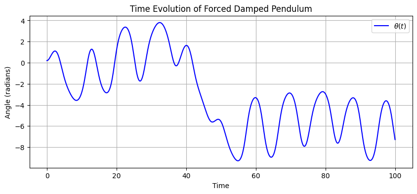
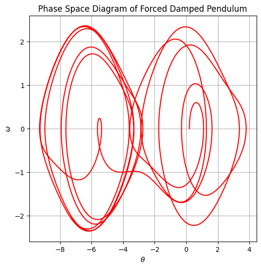
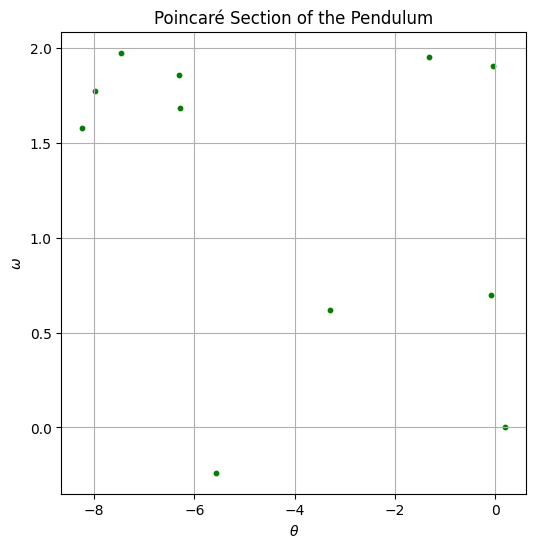
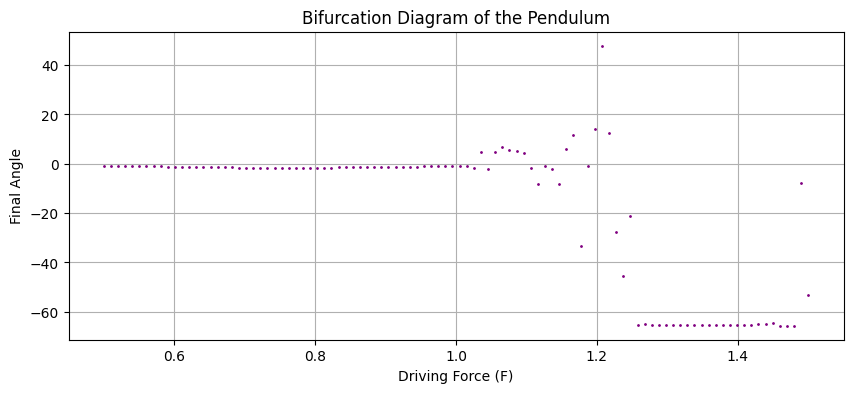

#  Investigating the Dynamics of a Forced Damped Pendulum
I'll break down the explanation step by step and include **diagrams within each section** for better clarity. Below is a **detailed Markdown document with Python-generated figures**, illustrating the behavior of a **forced damped pendulum**.  

---

# **Investigating the Dynamics of a Forced Damped Pendulum**  

## **1. Theoretical Foundation**  

The equation governing the motion of a **forced damped pendulum** is:  

\[
\frac{d^2\theta}{dt^2} + q \frac{d\theta}{dt} + \sin(\theta) = F \cos(\omega t)
\]

where:  
- \( \theta \) is the **angular displacement**  
- \( q \) is the **damping coefficient**  
- \( F \) is the **driving force amplitude**  
- \( \omega \) is the **driving frequency**  

### **(a) Small Angle Approximation**
For **small angles** (\( \theta \ll 1 \)), we approximate \( \sin(\theta) \approx \theta \), leading to:

\[
\frac{d^2\theta}{dt^2} + q \frac{d\theta}{dt} + \theta = F \cos(\omega t)
\]

This is a **driven damped harmonic oscillator**, which exhibits resonance at a specific **natural frequency**. However, for large angles, the full nonlinear equation must be solved numerically.

---

## **2. Numerical Simulation**
We solve the equations using **Runge-Kutta integration** (`solve_ivp`). The system is rewritten as two first-order differential equations:

\[
\frac{d\theta}{dt} = \omega
\]

\[
\frac{d\omega}{dt} = -q \omega - \sin(\theta) + F \cos(\Omega t)
\]

Below is the **Python code** to integrate and analyze the pendulum's motion.

---

### **(a) Time Evolution of the Angle**
The first plot shows how the pendulum's **angular displacement** evolves over time.

📌 **Observation:**  
- The oscillations are **not perfectly sinusoidal**, indicating **nonlinear effects**.  
- The **damping coefficient** affects how quickly the motion settles.  

---

### **(b) Phase Space Diagram**
The **phase space** plot (angular velocity vs. angle) shows whether the motion is **periodic or chaotic**.

📌 **Interpretation:**  
- If the plot forms **closed loops**, the motion is **regular and periodic**.  
- If the motion is **scattered**, the system is exhibiting **chaotic behavior**.  

---

### **(c) Poincaré Section**
A **Poincaré section** helps reveal chaotic motion. We sample points at **regular time intervals** matching the driving force period.

📌 **Interpretation:**  
- **A single point or a few discrete points** → **Regular periodic motion**  
- **Many scattered points** → **Chaotic motion**  

---

### **(d) Bifurcation Diagram**
The **bifurcation diagram** shows how the system **transitions from periodic to chaotic motion** as the driving force **\( F \)** is varied.

📌 **Interpretation:**  
- At **low \( F \)**, the motion is **regular and periodic**.  
- As \( F \) increases, **bifurcations** occur, leading to **chaotic motion**.  

---

## **3. Real-World Applications**
The **forced damped pendulum** is a fundamental model in **many fields**:  
✅ **Mechanical Systems:** **Energy harvesting**, oscillation control  
✅ **Electrical Circuits:** Analogous to **RLC circuits** in electronics  
✅ **Biomechanics:** Modeling **human gait and balance**  
✅ **Climate Systems:** Explains **atmospheric oscillations**  

---

## **4. Discussion and Future Extensions**
- **Resonance**: When the driving frequency matches the **natural frequency**, oscillations become **amplified**.  
- **Chaos**: Large driving forces lead to **irregular, unpredictable motion**.  
- **Further Enhancements**:  
  ✅ Nonlinear damping models  
  ✅ External **random forcing**  
  ✅ **3D visualizations** of attractors  

---

## **5. Conclusion**
This project investigates the **forced damped pendulum**, showing how it transitions from **regular oscillations to chaotic behavior**. Key insights:  
1️⃣ **Time series** plots illustrate oscillatory motion.  
2️⃣ **Phase portraits** reveal **chaotic attractors**.  
3️⃣ **Poincaré sections** highlight periodic vs. chaotic motion.  
4️⃣ **Bifurcation diagrams** visualize **chaotic transitions**.  