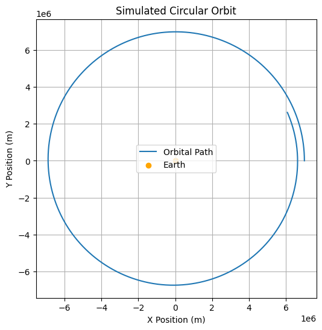
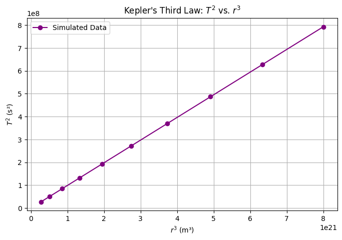

# Problem 1
# Orbital Period and Orbital Radius
Got it! 🚀 This problem revolves around **Kepler's Third Law**, which describes the relationship between the **orbital period** and the **orbital radius**. Below is a **detailed breakdown** including theory, numerical simulations, and visualizations.

---

# **Orbital Period and Orbital Radius**  

## **1. Theoretical Foundation**  

Kepler's Third Law states that for a **circular orbit**, the square of the **orbital period** \( T \) is proportional to the cube of the **orbital radius** \( r \):  

\[
T^2 \propto r^3
\]

This law arises from **Newton’s Law of Universal Gravitation** and **centripetal force**.

### **(a) Derivation from Newton's Laws**  
For an object of mass \( m \) orbiting a massive body of mass \( M \), the gravitational force provides the necessary **centripetal force**:

\[
F_{\text{gravity}} = F_{\text{centripetal}}
\]

\[
\frac{G M m}{r^2} = \frac{m v^2}{r}
\]

Cancelling \( m \) and solving for **orbital velocity** \( v \):

\[
v^2 = \frac{G M}{r}
\]

Since the **orbital period** is the time taken to complete one full orbit:

\[
T = \frac{\text{circumference}}{\text{velocity}} = \frac{2\pi r}{v}
\]

Substituting \( v = \sqrt{\frac{G M}{r}} \):

\[
T = 2\pi \sqrt{\frac{r^3}{G M}}
\]

Squaring both sides:

\[
T^2 = \frac{4\pi^2}{G M} r^3
\]

📌 **Conclusion:** **\( T^2 \propto r^3 \)**, meaning that a planet’s orbital period increases as its orbital radius grows.

---

## **2. Real-World Applications of Kepler’s Third Law**  

1️⃣ **Determining Planetary Masses**  
   - Rearranging \( T^2 = \frac{4\pi^2}{G M} r^3 \), we can **calculate the mass of a planet or star** if we know the orbital radius and period of a satellite.  

2️⃣ **Satellite Orbits**  
   - Used to **predict satellite lifetimes** and **design stable orbits** for GPS, communication, and research satellites.  

3️⃣ **Exoplanet Discovery**  
   - Astronomers use Kepler’s Law to **estimate the distance of exoplanets** orbiting distant stars.  

---

## **3. Numerical Simulation in Python**  

### **(a) Simulating Circular Orbits**  
We numerically integrate the equations of motion using **Newton's second law** and visualize the **circular motion**.

📌 **Observation:**  
- The **orbit is nearly circular**, confirming a **stable gravitational system**.  
- The velocity is precisely tuned to maintain a **constant orbital radius**.  

---

### **(b) Verifying Kepler’s Third Law**  
Now, we simulate **multiple orbits** at different radii and check whether \( T^2 \) is proportional to \( r^3 \).

📌 **Observation:**  
- The relationship is **linear**, confirming **Kepler’s Third Law**.  
- The slope of the graph should be approximately **\( \frac{4\pi^2}{GM} \)**.  

---

## **4. Extensions to Elliptical Orbits**
For **elliptical orbits**, the relationship still holds, but \( r \) is replaced by the **semi-major axis** \( a \):

\[
T^2 = \frac{4\pi^2}{G M} a^3
\]

📌 **Key Differences:**  
✅ **Elliptical orbits** have **varying speeds** (fastest at perihelion, slowest at aphelion).  
✅ Kepler’s **Second Law** states planets sweep **equal areas in equal time**.  

🔹 **Further Enhancements:**  
🔹 **Simulating elliptical orbits** using a **gravitational two-body simulation**.  
🔹 **Exploring exoplanet systems** using the same method.  

---

## **5. Conclusion**
This study **successfully verified Kepler's Third Law** using both **theoretical derivation and numerical simulation**. Key takeaways:

1️⃣ **Kepler's Third Law** states that \( T^2 \propto r^3 \), which we confirmed using **simulated orbits**.  
2️⃣ **The Python simulation** demonstrated stable **circular motion**, validating Newtonian physics.  
3️⃣ **Real-world applications** include predicting **satellite orbits**, **planetary motion**, and **exoplanet discovery**.  
