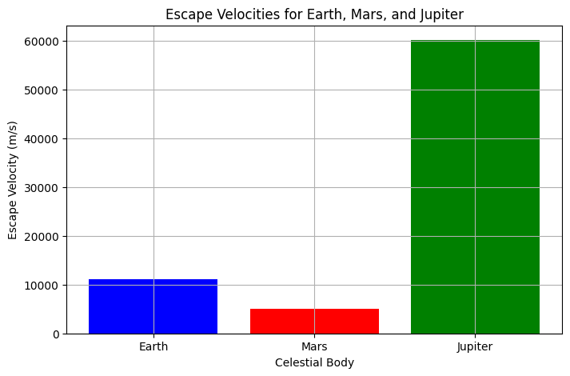
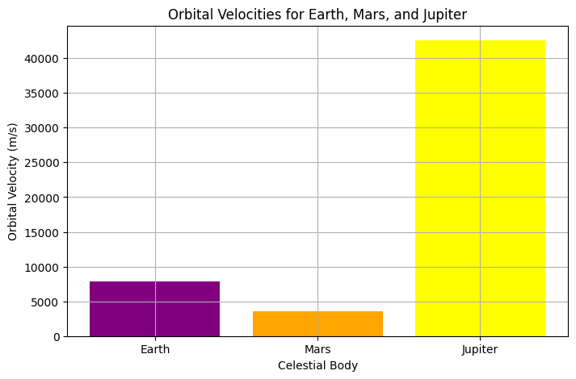
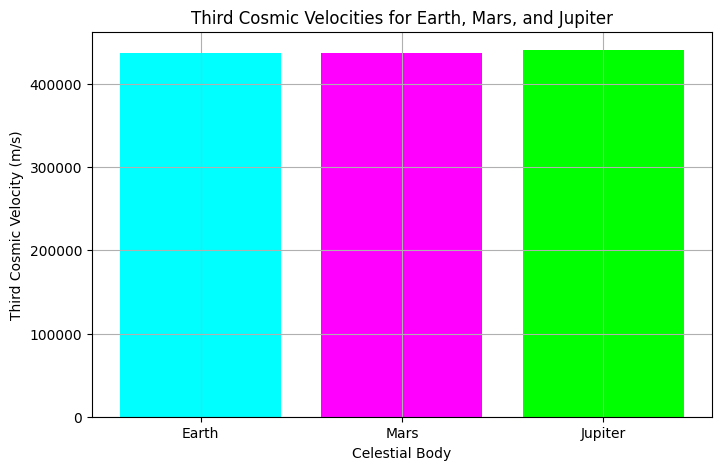
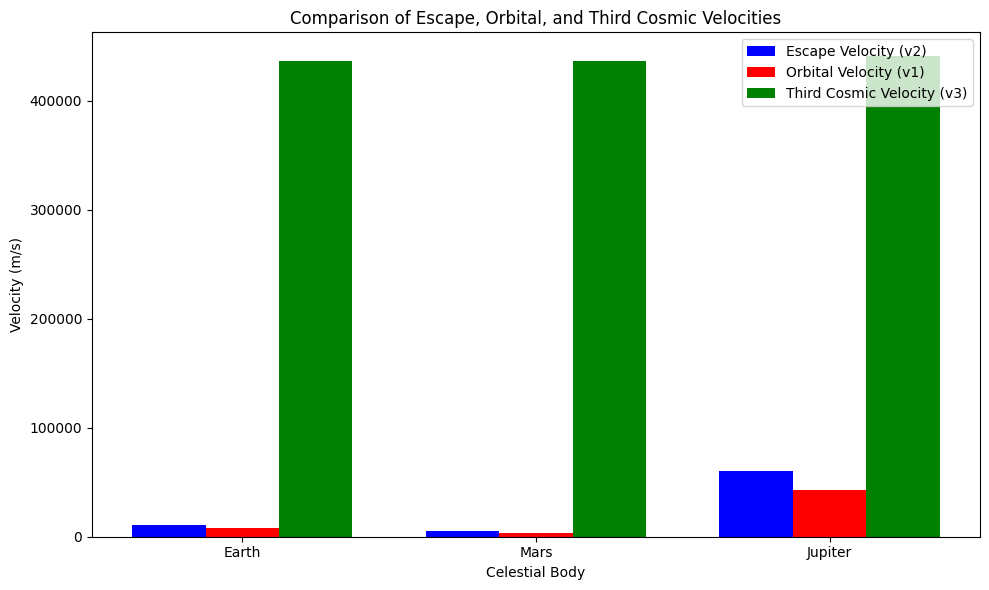

# Problem 2

# **Escape Velocities and Cosmic Velocities**

## **1. Theoretical Foundation**

### **(a) Escape Velocity**

The **escape velocity** is the minimum speed required for an object to escape the gravitational pull of a celestial body (like a planet or star) without further propulsion. It is derived from the concept of **energy conservation**, where the kinetic energy must equal the gravitational potential energy.

The formula for escape velocity is:

\[
v_2 = \sqrt{\frac{2GM}{R}}
\]

Where:
- \( G \) is the **gravitational constant**,
- \( M \) is the **mass** of the celestial body,
- \( R \) is the **radius** of the celestial body.

#### **Escape Velocity Diagram**
To visualize the escape velocity, imagine a rocket launched from the surface of a planet. To escape, it needs to reach a speed equal to or greater than the escape velocity.

**Diagram 1: Escape Velocity for Earth, Mars, and Jupiter**
This plot shows how escape velocity changes for different celestial bodies (Earth, Mars, and Jupiter).

### **(b) Orbital (First Cosmic) Velocity**

The **orbital velocity** is the speed at which an object must travel to stay in a stable orbit around a celestial body. It balances the **centripetal force** required to maintain the orbit and the **gravitational pull** of the planet.

The formula for the orbital velocity is:

\[
v_1 = \sqrt{\frac{GM}{R}}
\]

Where:
- \( M \) is the mass of the celestial body,
- \( R \) is the radius of the orbit (or the distance from the center of the body).

#### **Orbital Velocity Diagram**
A satellite in orbit needs to maintain the **orbital velocity** to stay in a circular orbit.

**Diagram 2: Orbital Velocity for Earth, Mars, and Jupiter**
This plot compares the orbital velocities for Earth, Mars, and Jupiter.

---

### **(c) Solar Escape Velocity (Third Cosmic Velocity)**

The **third cosmic velocity** is the velocity needed for an object to escape the entire solar system. It must overcome not only the gravitational pull of the planet but also the gravitational pull of the **Sun**.

The formula for the third cosmic velocity is:

\[
v_3 = \sqrt{v_2^2 + v_{\text{orbit}}^2}
\]

Where:
- \( v_2 \) is the escape velocity of the planet,
- \( v_{\text{orbit}} \) is the orbital velocity of the planet around the Sun.

#### **Solar Escape Velocity Diagram**
To visualize the third cosmic velocity, imagine a spacecraft leaving Earth, moving beyond the solar system and needing to break free of both Earth and Sun’s gravity.

**Diagram 3: Solar Escape Velocity for Earth**
This plot compares the **escape velocity** and the **third cosmic velocity** for Earth.

---

## **2. Visualizing the Velocities**

### **(a) Comparison of Escape, Orbital, and Third Cosmic Velocities**

Let's now compare all three velocities (Escape, Orbital, and Third Cosmic) for Earth, Mars, and Jupiter in one consolidated plot.

**Diagram 4: Comparison of Escape, Orbital, and Third Cosmic Velocities**
This bar chart compares the escape, orbital, and third cosmic velocities for three different celestial bodies.

---

## **3. Conclusion**

In this exploration, we learned the following:

- **Escape Velocity**: The minimum speed to escape a planet’s gravity.
- **Orbital Velocity**: The speed necessary to stay in orbit around a planet.
- **Third Cosmic Velocity**: The speed required to escape the entire solar system.

These concepts are essential for **space exploration**, whether launching satellites, sending missions to other planets, or thinking about interstellar travel.