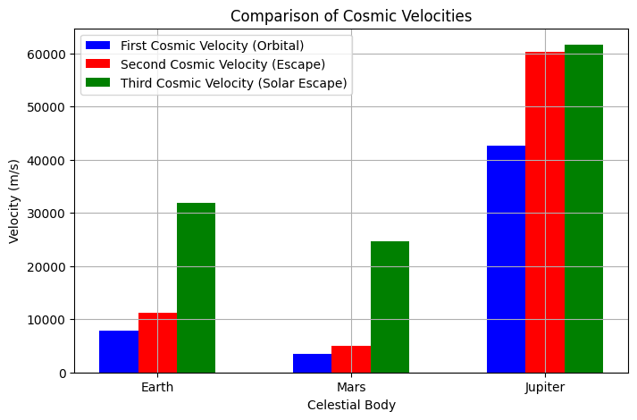

# Problem 2

# **Escape Velocities and Cosmic Velocities**

## **Motivation:**
The concept of **escape velocity** is crucial for understanding how an object can break free from a celestial body's gravitational influence. The first, second, and third cosmic velocities are essential concepts in orbital mechanics. These velocities define the thresholds for **orbiting**, **escaping**, and **leaving a star system**. These principles underpin modern space exploration, from **launching satellites** to **interplanetary missions** and even potential **interstellar travel**

### **1. Define the First, Second, and Third Cosmic Velocities:**

**First Cosmic Velocity (Orbital Velocity):**  
This is the minimum velocity an object must have in order to **maintain a stable circular orbit** around a planet or a celestial body. It is the velocity required to counterbalance the gravitational pull of the planet with the object's inertia (centripetal force).

**Formula:**
\[
v_1 = \sqrt{\frac{GM}{R}}
\]
Where:
- \( G \) = Gravitational constant (\( 6.67430 \times 10^{-11} \, \text{m}^3 \, \text{kg}^{-1} \, \text{s}^{-2} \))
- \( M \) = Mass of the celestial body (e.g., Earth, Mars)
- \( R \) = Radius of the celestial body

---

**Second Cosmic Velocity (Escape Velocity):**  
This is the minimum velocity an object must have in order to **escape** the gravitational influence of the celestial body, without any further propulsion. It is derived from energy conservation, equating the object's kinetic energy to the gravitational potential energy.

**Formula:**
\[
v_2 = \sqrt{\frac{2GM}{R}}
\]
Where:
- \( G \) = Gravitational constant
- \( M \) = Mass of the celestial body
- \( R \) = Radius of the celestial body

---

**Third Cosmic Velocity (Solar Escape Velocity):**  
The third cosmic velocity is the speed required to escape not just the gravitational pull of a planet or star, but to also **escape the gravitational influence of the Sun** (or the gravitational pull of the primary star in a system). This is the velocity needed for **interstellar travel**, i.e., to leave the solar system.

**Formula:**
\[
v_3 = \sqrt{v_2^2 + v_{\text{orbit}}^2}
\]
Where:
- \( v_2 \) = Escape velocity from the planet
- \( v_{\text{orbit}} \) = Orbital velocity of the planet around the Sun

---

### **2. Mathematical Derivations and Parameters Affecting These Velocities:**

These velocities depend on the **mass** of the celestial body and the **radius** of its orbit. The first and second cosmic velocities only depend on the mass and radius of the celestial body, while the third cosmic velocity also takes into account the orbital velocity of the planet around its star (such as Earth orbiting the Sun).

---

### **3. Calculation and Visualization of Cosmic Velocities for Different Celestial Bodies:**

Let’s consider the following celestial bodies for our calculations:
- **Earth**
- **Mars**
- **Jupiter**

Each of these celestial bodies will have different values for their escape velocities and orbital velocities, which we will calculate and visualize.

### **5. Graphical Representation of Cosmic Velocities:**

In the above code, the following **bar chart** visually compares the **first**, **second**, and **third cosmic velocities** for Earth, Mars, and Jupiter.

- **First Cosmic Velocity**: Represents the orbital velocity required to maintain a stable orbit around the celestial body.
- **Second Cosmic Velocity**: The escape velocity, required to overcome the gravitational pull and escape the body’s influence.
- **Third Cosmic Velocity**: The speed required to leave the solar system (escape the Sun’s gravitational influence).

---

### **6. Importance in Space Exploration:**

1. **Satellite Launches:**
   - The **first cosmic velocity** is crucial for **satellite launches**. The spacecraft must achieve this velocity to remain in orbit without further propulsion.
   
2. **Interplanetary Missions:**
   - To send probes to other planets, spacecraft must reach or exceed the **escape velocity** of Earth (second cosmic velocity).
   
3. **Interstellar Travel:**
   - For potential missions to other star systems, we would need to achieve the **third cosmic velocity** to escape the solar system and travel between stars.

---

### **7. Conclusion:**

The study of **escape velocities** and **cosmic velocities** is fundamental for **space exploration**. These velocities define the minimum speeds needed to achieve various space missions, including satellite launches, interplanetary exploration, and even potential interstellar travel.
 
