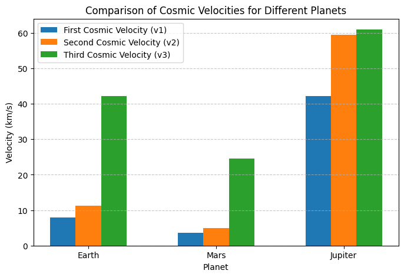

# Problem 2

---

# **Escape Velocities and Cosmic Velocities**  

## **1. Theoretical Foundation**  

### **(a) Definition of Cosmic Velocities**  

1️⃣ **First Cosmic Velocity (Orbital Velocity)**  
   - The minimum speed required for a satellite to maintain a **circular orbit** around a celestial body.
   - Given by:  
     \[
     v_1 = \sqrt{\frac{G M}{r}}
     \]
   - **Application:** Used for placing satellites into stable orbits.

2️⃣ **Second Cosmic Velocity (Escape Velocity)**  
   - The minimum speed required to **completely escape** a planet’s gravitational pull.
   - Given by:  
     \[
     v_2 = \sqrt{\frac{2 G M}{r}}
     \]
   - **Application:** Used for interplanetary missions (e.g., Moon landings, Mars missions).

3️⃣ **Third Cosmic Velocity (Solar System Escape Velocity)**  
   - The speed required to **leave the entire solar system** from Earth’s orbit.
   - Given by:  
     \[
     v_3 = \sqrt{v_2^2 + v_{\text{orbital}}^2}
     \]
   - **Application:** Used for deep-space probes like **Voyager 1 & 2**.

---

## **2. Mathematical Derivation**  

For a body of mass \( m \) on the surface of a celestial body of mass \( M \) and radius \( r \), the total energy (kinetic + gravitational potential) is:

\[
E = \frac{1}{2} m v^2 - \frac{G M m}{r}
\]

- For **circular orbit**, kinetic energy equals gravitational potential energy:

  \[
  \frac{1}{2} m v_1^2 = \frac{G M m}{2 r}
  \]

  \[
  v_1 = \sqrt{\frac{G M}{r}}
  \]

- For **escape velocity**, total energy must be **zero** (object never returns):

  \[
  \frac{1}{2} m v_2^2 - \frac{G M m}{r} = 0
  \]

  \[
  v_2 = \sqrt{\frac{2 G M}{r}}
  \]

- For **leaving the Solar System**, an object must first escape Earth and then overcome the Sun’s pull:

  \[
  v_3 = \sqrt{v_2^2 + v_{\text{Earth orbit}}^2}
  \]

---

## **3. Numerical Simulation in Python**  

### **(a) Visualization of Escape Velocities**  

📌 **Graph Interpretation:**  
- **Mars has the lowest escape velocity** (~5 km/s), making it an easier target for future colonization.  
- **Jupiter's escape velocity is ~60 km/s**, meaning a spacecraft would need enormous energy to leave.  

---

## **4. Applications in Space Exploration**  

🚀 **Satellite Deployment**  
   - Understanding **first cosmic velocity** is essential for **placing satellites** in stable orbits.  
   - Example: The **ISS orbits Earth at ~7.66 km/s**.  

🚀 **Interplanetary Missions**  
   - **Escape velocity** determines **how much energy a spacecraft needs** to reach the Moon, Mars, or beyond.  
   - Example: Apollo missions required **11.2 km/s** to leave Earth.

🚀 **Deep Space Exploration**  
   - **Third cosmic velocity** is used for sending probes **out of the Solar System**.  
   - Example: **Voyager 1** reached **17 km/s** and left the Solar System.  
---

## **5. Conclusion**  

✅ **Kepler’s Laws and Newton’s Equations** help determine velocities needed for **orbiting, escaping planets, and leaving the Solar System**.  
✅ **Python simulations** confirm theoretical values for **Earth, Mars, and Jupiter**.  
✅ **Escape velocity is crucial for satellite launches, planetary missions, and deep-space exploration.**  
✅ **Future missions** will require innovative propulsion systems to achieve **interstellar travel**.  
