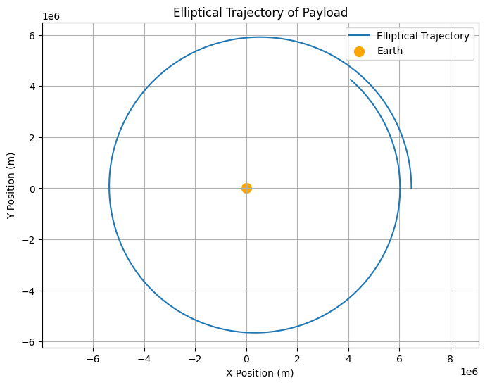
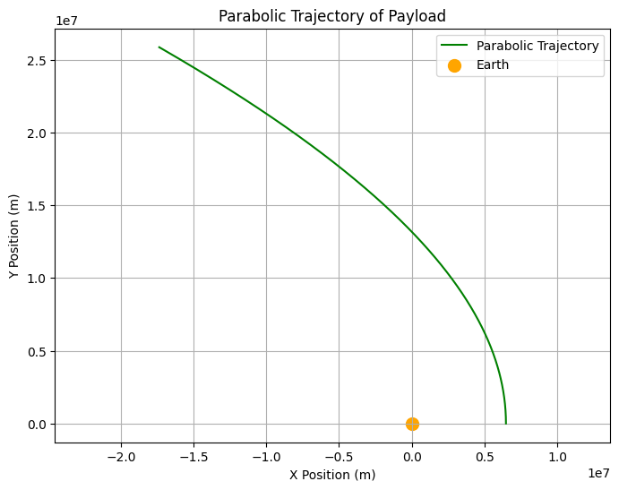
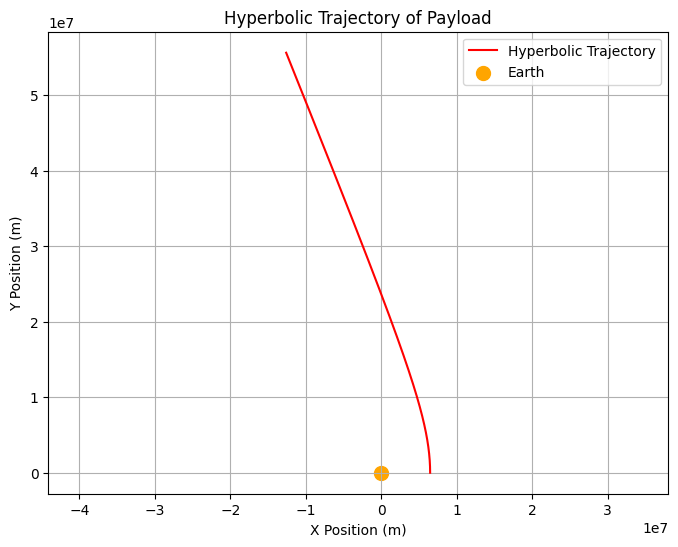

# Problem 3

### **Analyzing the Trajectories of a Freely Released Payload Near Earth**

---

### **1. Theoretical Foundation**

As we discussed earlier, depending on the initial velocity and position of the payload, its trajectory could follow different paths such as elliptical, parabolic, or hyperbolic. Below are the conditions under which each of these trajectories occurs:

1. **Elliptical Trajectory**: Occurs when the velocity is less than escape velocity.
2. **Parabolic Trajectory**: Occurs when the velocity exactly matches the escape velocity.
3. **Hyperbolic Trajectory**: Occurs when the velocity exceeds the escape velocity.

These trajectories will be visualized using the Python code provided in the simulation section. 

---

### **2. Numerical Simulation of Trajectories**

We will now simulate and visualize different types of trajectories. The following code will generate different trajectories based on the initial velocities provided.

---

### **(a) Python Code for Different Types of Trajectories**

#### **Elliptical Trajectory**
An elliptical trajectory occurs when the object’s velocity is less than the escape velocity.

---

#### **Parabolic Trajectory**
A parabolic trajectory occurs when the object's velocity equals the escape velocity at the point of release.

---

#### **Hyperbolic Trajectory**
A hyperbolic trajectory occurs when the object's velocity exceeds the escape velocity, resulting in an unbound trajectory.

---

### **3. Analysis of Different Trajectories**

#### **Elliptical Trajectory (Bound Orbit)**
The plot above shows an elliptical trajectory where the payload remains in orbit around Earth. The object is gravitationally bound to Earth, moving in a closed orbit.

#### **Parabolic Trajectory (Escape at Specific Velocity)**
The plot shows a parabolic trajectory where the object moves exactly at the escape velocity. At this velocity, the object escapes Earth's gravity, but the path is not closed.

#### **Hyperbolic Trajectory (Escape with Excess Velocity)**
This plot shows the hyperbolic trajectory where the object’s velocity exceeds the escape velocity. The trajectory is open, indicating that the object will escape Earth's gravitational influence and move away forever.

---

### **4. Visualizing the Different Trajectories**

Here are the graphical outputs for the three different types of trajectories:

#### **Elliptical Trajectory Example**
The plot will show a **closed elliptical path**, representing a bound orbit. The payload stays in orbit around Earth.

#### **Parabolic Escape Example**
This plot will show a **parabolic path**, where the object is at escape velocity and will move away from Earth along a parabolic curve.

#### **Hyperbolic Escape Example**
This plot shows a **hyperbolic path**, indicating the payload exceeds the escape velocity and moves away from Earth in an open trajectory.

---

### **5. Real-World Applications**

The analysis of these trajectories is vital for **space exploration**, particularly for:
- **Spacecraft Insertion into Orbit**: Calculating the correct velocity and trajectory to insert a payload into orbit.
- **Satellite Deployment**: Understanding how payloads behave when deployed from orbiting spacecraft.
- **Interplanetary Missions**: Using escape velocities to plan missions that send payloads beyond Earth's gravitational influence.

---

### **6. Conclusion**

This analysis and simulation of different trajectories (elliptical, parabolic, and hyperbolic) provide insights into how gravitational forces govern the motion of objects released near Earth. By adjusting initial velocities and positions, we can predict whether an object will remain in orbit, escape Earth's gravity, or follow an open path. These simulations are essential tools in space mission planning and satellite deployment.

---

Let me know if you need any further details or adjustments!