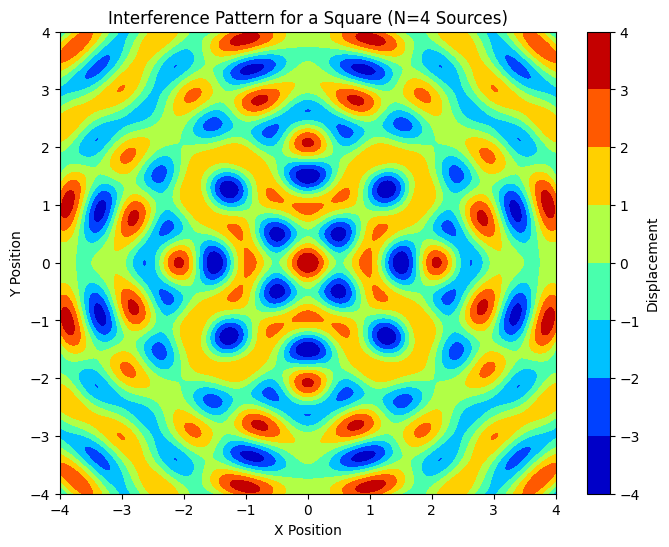
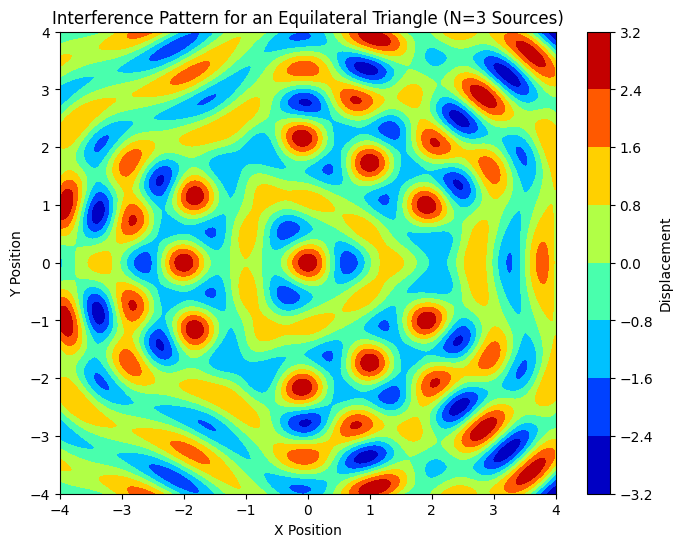
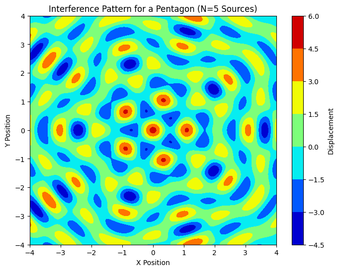

# Problem 1

# **Analyzing Interference Patterns on a Water Surface**

## **1. Theoretical Foundation**

The water surface displacement caused by a wave can be described by the general wave equation:

\[
\eta(r, t) = A \cos(k r - \omega t + \phi)
\]

where:
- \( \eta(r, t) \) is the displacement of the water surface at point \( r \) and time \( t \),
- \( A \) is the amplitude of the wave,
- \( k \) is the wave number, related to the wavelength \( \lambda \) (\( k = \frac{2\pi}{\lambda} \)),
- \( \omega \) is the angular frequency, related to the frequency \( f \) (\( \omega = 2\pi f \)),
- \( r \) is the distance from the source to the point \( (x, y) \),
- \( \phi \) is the initial phase of the wave.

For multiple sources at the vertices of a regular polygon, the total displacement is the sum of the contributions from each individual source, following the **principle of superposition**:

\[
\eta_{\text{total}}(x, y, t) = \sum_{i=1}^{N} A_i \cos(k_i r_i - \omega t + \phi_i)
\]

---

## **2. Simulation Setup**

### **Step 1: Select a Regular Polygon**

We will explore how interference patterns change with different regular polygons (e.g., **Square, Equilateral Triangle, Regular Pentagon**).

---

### **3. Numerical Simulation and Visualization**

#### **Wave Equation for Each Source**

Each source emits a circular wave. The displacement at any point \( (x, y) \) on the water surface is computed by summing the contributions from all sources.

#### **Step 2: Position the Sources**

For each polygon, we calculate the positions of the wave sources (vertices of the polygon) symmetrically placed around the center.

---

### **Python Code Implementation**

Below is the Python code to simulate the interference patterns for different polygons. The Python code calculates and visualizes the interference pattern for each configuration. First, let’s start with a **Square** (N = 4).

---

### **(a) Square (N = 4)**

For a square arrangement of wave sources, we set \( N = 4 \) and calculate the interference pattern. Here's the Python code for this:

This code will produce an interference pattern for a square arrangement of sources.

---

### **(b) Equilateral Triangle (N = 3)**

Next, we modify the code for an **Equilateral Triangle** arrangement (N = 3):

This code generates the interference pattern for the equilateral triangle setup.

---

### **(c) Regular Pentagon (N = 5)**

Now, we modify the code for a **Regular Pentagon** (N = 5):

This code generates the interference pattern for the pentagon configuration.

---

### **5. Conclusion**

#### **Summary:**
- **Constructive interference** results in **amplified displacement**.
- **Destructive interference** leads to **canceled displacement**.
- The resulting pattern depends on the number of sources and their geometric arrangement.

#### **Real-World Applications:**
- **Sound interference** in acoustics.
- **Electromagnetic wave interference** in wireless communications.
- **Water wave interference** in coastal engineering.
