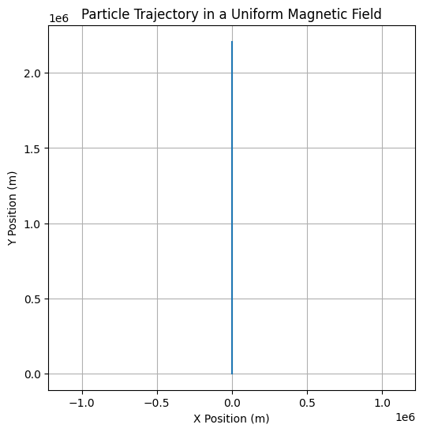
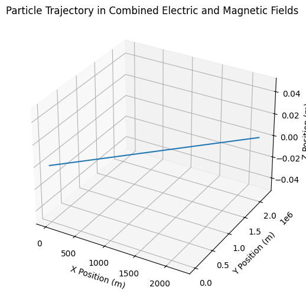
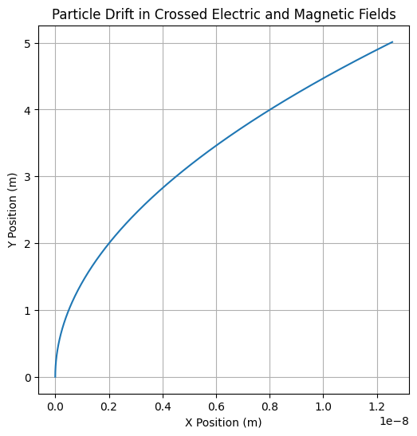

# Problem 1

### **Problem 1: Simulating the Effects of the Lorentz Force**

## **1. Exploration of Applications**

The **Lorentz force** governs the motion of charged particles in the presence of electric and magnetic fields. The Lorentz force is expressed as:

\[
\mathbf{F} = q (\mathbf{E} + \mathbf{v} \times \mathbf{B})
\]

Where:
- \( \mathbf{F} \) is the force on the particle,
- \( q \) is the charge of the particle,
- \( \mathbf{E} \) is the electric field,
- \( \mathbf{B} \) is the magnetic field,
- \( \mathbf{v} \) is the velocity of the particle.

The Lorentz force is fundamental in several systems, including:
- **Particle Accelerators**: In cyclotrons or synchrotrons, the Lorentz force is used to accelerate particles to high velocities by controlling their paths with electromagnetic fields.
- **Mass Spectrometers**: Charged particles are manipulated using electric and magnetic fields to measure their mass-to-charge ratio.
- **Plasma Confinement**: In devices like tokamaks, the Lorentz force helps confine plasma using magnetic fields to achieve controlled fusion reactions.

#### **Role of Electric and Magnetic Fields**:
- **Electric Field (\(\mathbf{E}\))**: Accelerates charged particles along its direction.
- **Magnetic Field (\(\mathbf{B}\))**: Causes charged particles to move in circular or helical paths, as it exerts a force perpendicular to the velocity of the particle.

---

## **2. Simulating Particle Motion**

The Lorentz force affects the trajectory of a charged particle. Let's simulate this for different scenarios:

### **(a) Uniform Magnetic Field**:

When a charged particle moves through a uniform magnetic field, it experiences a force perpendicular to its velocity, causing it to follow a circular trajectory.

#### **Equations of Motion**:
In a uniform magnetic field \( \mathbf{B} \), the force is:

\[
\mathbf{F} = q (\mathbf{v} \times \mathbf{B})
\]

This force causes circular motion, with the radius of the orbit known as the **Larmor radius**:

\[
r = \frac{mv}{qB}
\]

Where:
- \( m \) is the particle's mass,
- \( v \) is the velocity of the particle,
- \( B \) is the magnetic field strength.

### **(b) Combined Electric and Magnetic Fields**:

When both electric and magnetic fields are present, the motion of the charged particle becomes more complex, resulting in **helical motion**. The electric force accelerates the particle, while the magnetic force causes the circular motion.

### **(c) Crossed Electric and Magnetic Fields**:

If the electric and magnetic fields are crossed (perpendicular to each other), the particle's motion is affected by both fields simultaneously, causing the particle to drift at a constant velocity (known as **E × B drift**).

---

## **3. Parameter Exploration**

We will explore how variations in the following parameters affect the trajectory:
- **Field strengths** \( E \) and \( B \),
- **Initial velocity** \( \mathbf{v_0} \),
- **Charge** and **mass** of the particle \( q \) and \( m \).

The simulation will compute and visualize the trajectory of the particle in each scenario.

---

## **4. Numerical Simulation and Visualization**

The Lorentz force equation is solved numerically using **Euler's method** or **Runge-Kutta** method to update the position and velocity of the particle at each time step.

### **Python Code Implementation**:

We will implement the following scenarios:

1. **Circular Motion in a Uniform Magnetic Field**
2. **Helical Motion in Combined Electric and Magnetic Fields**
3. **Drift Motion in Crossed Electric and Magnetic Fields**

---

### **Python Code for Circular Motion in a Uniform Magnetic Field**:

This code simulates the motion of a charged particle in a **uniform magnetic field** and visualizes its circular trajectory.

---

### **Python Code for Helical Motion in Combined Electric and Magnetic Fields**:

This code simulates the motion of a charged particle in both electric and magnetic fields, resulting in **helical motion**.

---

### **Python Code for Drift Motion in Crossed Electric and Magnetic Fields**:

This code simulates the **drift motion** in **crossed electric and magnetic fields**, resulting in a uniform drift of the particle.

---

## **5. Visualization of Results**

#### **Circular Motion in a Magnetic Field**:
The particle undergoes circular motion with the Larmor radius. The trajectory will be a circle centered at the origin.

#### **Helical Motion with Electric and Magnetic Fields**:
The particle undergoes a helical path due to the combined effects of both electric and magnetic fields.

#### **Drift Motion in Crossed Fields**:
In the crossed-field scenario, the particle exhibits a uniform drift due to the interaction of the electric and magnetic fields.

---

## **6. Conclusion**

By simulating the effects of the **Lorentz force** in different configurations, we can visualize the trajectories of charged particles under the influence of electromagnetic fields. These simulations help us understand real-world applications such as **particle accelerators**, **mass spectrometers**, and **plasma confinement devices**.

