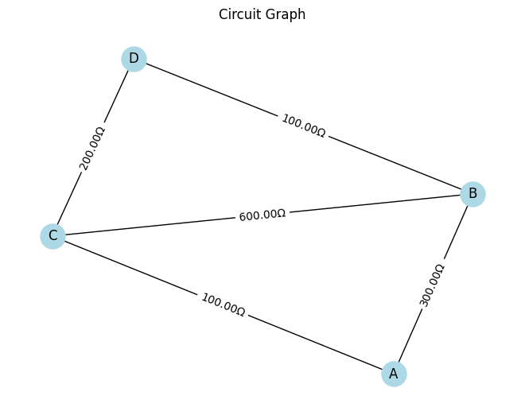
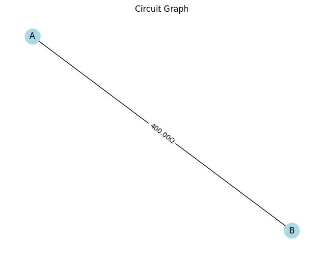

# 🧮 **Problem 1: Equivalent Resistance Using Graph Theory**

---

## 🔍 **1. Motivation**

Determining equivalent resistance in a circuit with multiple resistors is a classic challenge in physics and engineering. While simple circuits can be solved with series and parallel rules, **complex circuits with many junctions, loops, and nested resistors require more powerful methods**.

**Graph theory** provides a modern and efficient approach:
- **Nodes** represent junctions,
- **Edges** represent resistors, weighted by their resistance values.

This structure allows us to apply algorithms from computer science to **automate the simplification** process, which is especially useful in simulation software, electrical optimization, and network design.

---

## 🧠 **2. Theory and Concept**

### 🧷 Key Idea:
Model the circuit as an **undirected weighted graph**, then simplify it by reducing series and parallel edges iteratively until the graph consists of a single edge between the input and output nodes.

### 📐 Series Combination:
If two resistors \( R_1 \) and \( R_2 \) are in **series**, their equivalent resistance is:

\[
R_{\text{eq}} = R_1 + R_2
\]

### 🔀 Parallel Combination:
If \( R_1 \) and \( R_2 \) are in **parallel**, the equivalent resistance is:

\[
\frac{1}{R_{\text{eq}}} = \frac{1}{R_1} + \frac{1}{R_2}
\]

---

## 🧩 **3. Algorithm Overview**

### 📌 Goal:
Reduce the circuit to a single resistor between the start and end nodes.

### 🔁 Steps:
1. **Build a graph**: Use `networkx` to represent the circuit.
2. **Detect series and parallel connections**:
   - Series: Node with degree 2 (not start/end) → collapse into one resistor.
   - Parallel: Multiple edges between the same pair of nodes → merge.
3. **Iteratively reduce** the graph.
4. **Return the resistance** between start and end nodes.

---





## 🧪 **5. Test Examples**

### ⚡ Example 1: Series Circuit
```python
G = nx.MultiGraph()
G.add_edge('A', 'C', resistance=10)
G.add_edge('C', 'B', resistance=20)
```
➡ Result: \( R_{\text{eq}} = 30 \, \Omega \)

---

### 🔁 Example 2: Parallel Circuit
```python
G = nx.MultiGraph()
G.add_edge('A', 'B', resistance=10)
G.add_edge('A', 'B', resistance=20)
```
➡ Result: \( R_{\text{eq}} = \frac{1}{\frac{1}{10} + \frac{1}{20}} = 6.67 \, \Omega \)

---

### 🧠 Example 3: Nested Configuration
```python
G = nx.MultiGraph()
G.add_edge('A', 'X', resistance=5)
G.add_edge('X', 'B', resistance=5)
G.add_edge('A', 'B', resistance=10)
```
➡ Series path: 5 + 5 = 10 → Parallel with 10  
Final \( R_{\text{eq}} = 5 \, \Omega \)

---

## 📈 **6. Visualization**

Each step of simplification is visualized using `matplotlib`, helping to trace the collapse of the network from a full graph into a single resistor.

---

## 🧩 **7. Efficiency and Improvements**

### 💡 Complexity:
- **Each iteration** of simplification runs in approximately \( O(n) \) over nodes and edges.
- Efficient for small to medium circuits.

### 🚀 Improvements:
- Implement **Kirchhoff’s Laws** and use **matrix methods** for large networks.
- Add **support for voltage/current sources** for full circuit analysis.
- Integrate with symbolic solvers like `sympy` for symbolic reduction.

---

## 🧲 **8. Real-World Applications**

- **Circuit Design Tools**: Auto-reducing complex resistor networks.
- **Optimization Algorithms**: Finding paths of least resistance.
- **Education**: Teaching simplification via interactive simulations.
- **Network Analysis**: Modeling traffic, fluid flow, or thermal resistance.

---

## ✅ **9. Conclusion**

Using **graph theory**, we've built an automated system that:
- Models circuits as graphs,
- Reduces them through series and parallel rules,
- Outputs equivalent resistance — even in **complex, nested configurations**.

This approach gives both computational power and conceptual clarity — a true fusion of **physics and computer science**.
