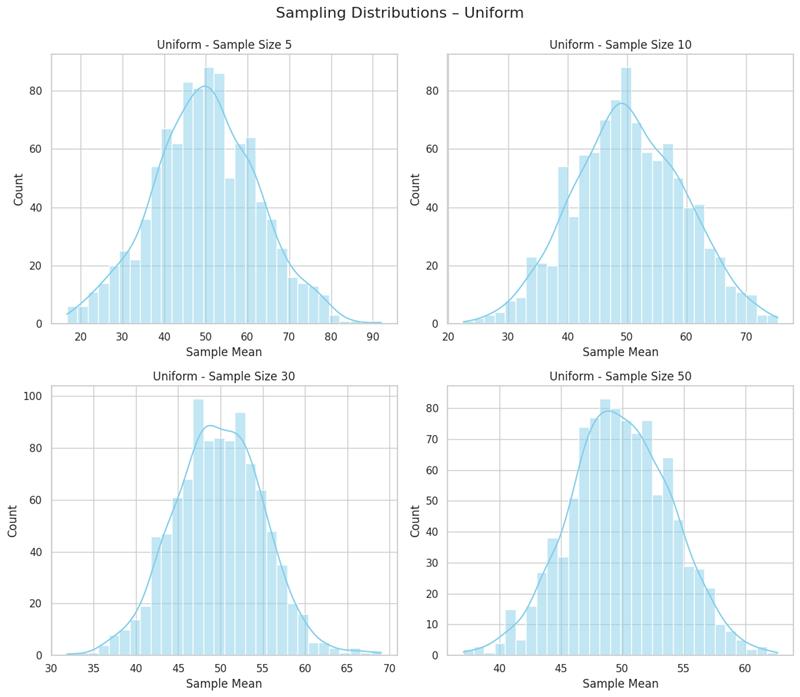
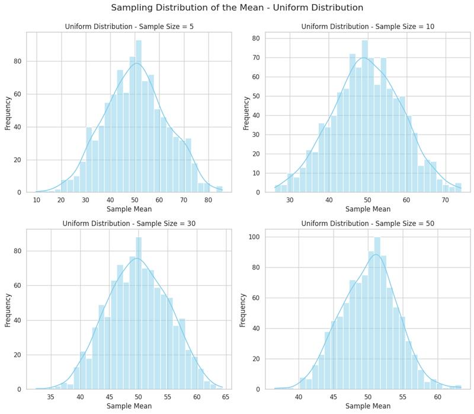
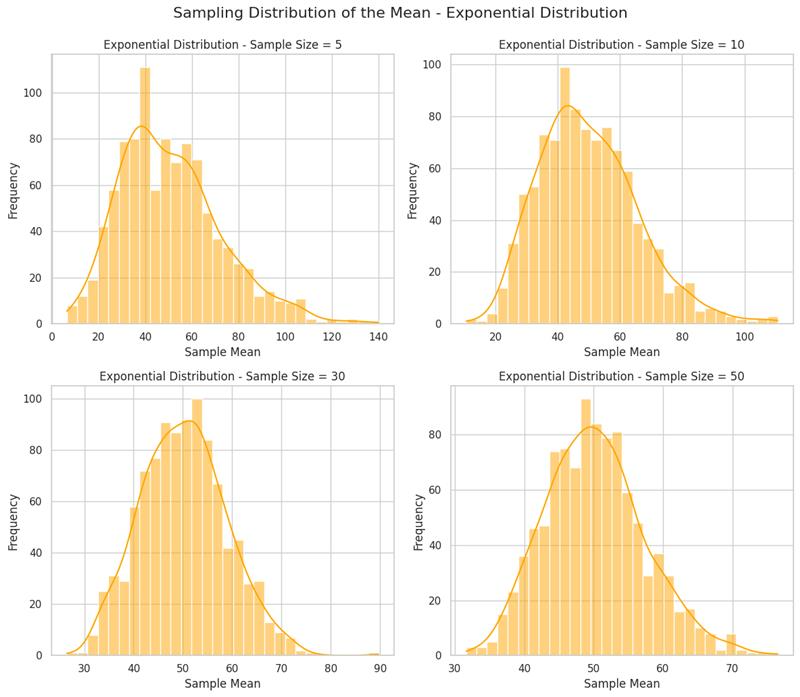
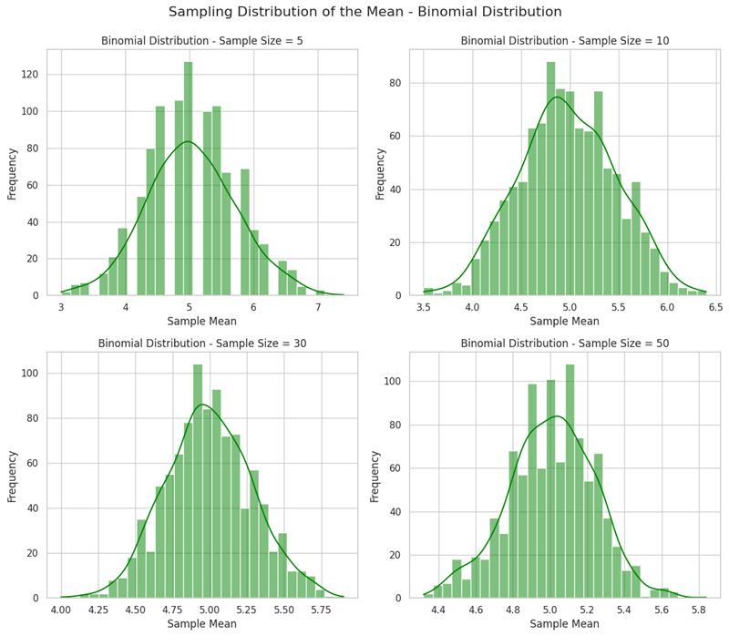
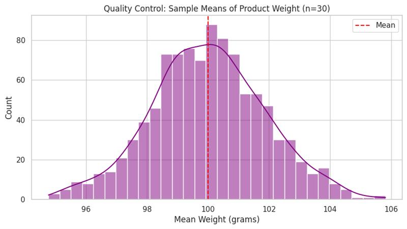
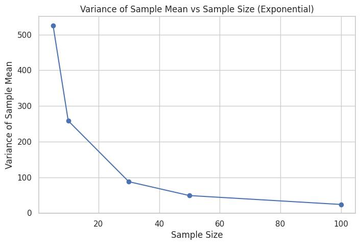

## 📘 **Statistics Task – Problem 1**  
### **Exploring the Central Limit Theorem Through Simulations**
 
---
 
### 🔥 **Motivation**
 
The **Central Limit Theorem (CLT)** is one of the most fundamental results in statistics. It states that, given a sufficiently large sample size, the distribution of the sample mean will approximate a **normal distribution**, regardless of the original population distribution's shape—whether it's uniform, skewed, or binomial.
 
Understanding this theorem is crucial for many real-world statistical practices, such as hypothesis testing, confidence intervals, and modeling population behavior. By using simulations, we can **visually explore** and better understand how and why this convergence happens.
 
---
 
### ✅ **1. Simulating Sampling Distributions**
 
We will use Python to simulate large populations from different types of distributions:
- **Uniform Distribution**
- **Exponential Distribution**
- **Binomial Distribution**
 
Each distribution will be used to generate a **large population** (e.g., 100,000 values), simulating a real-world dataset.
 

 
---
 
### 📊 **2. Sampling and Visualization**
 
We will:
- Draw **random samples** of sizes 5, 10, 30, and 50 from each population.
- **Repeat the sampling 1000 times** to create sampling distributions.
- **Plot histograms** of the sample means to visualize how they approach a normal distribution.
 
#### 🔁 Code for Sampling and Plotting

These plots show how the sample mean distribution **becomes more bell-shaped** (normal) as the sample size increases.
 
---
 
### 🔍 **3. Parameter Exploration**
 
This section explores **how the shape of the population distribution** and **sample size** affect convergence to normality.
 
#### Key Observations:
 
- For **Uniform Distribution**: Convergence to normal shape is quite fast, even at sample size = 10.
- For **Exponential Distribution** (skewed): Needs a **larger sample size** (30 or 50) to resemble a normal distribution.
- For **Binomial Distribution**: Being discrete, it still converges, but shows more variance with small samples.
 
#### Variance Impact:
 

- Higher population variance → **wider sampling distribution**
- As sample size ↑, variance of the sample mean ↓ (spread becomes tighter)
 
---
 
### 🌍 **4. Practical Applications of the CLT**
 
The CLT underpins many **real-world applications**, including:
 
- **Estimating population parameters**: From small samples in surveys or experiments.
- **Quality control in manufacturing**: Sampled products' weights, sizes, etc., can be assumed to follow normal distribution if enough samples are taken.
- **Predicting outcomes in finance**: Portfolio returns, average risk estimations assume normality for modeling.
 
#### Why it's useful:
- You don’t need to know the full population distribution.
- Small samples still yield powerful insights thanks to CLT.
- Helps with constructing **confidence intervals** and conducting **hypothesis tests**.

---
 
### 📦 **Deliverables Summary**
 
You should turn in:
- ✅ A **Markdown report** with:
  - Motivation section
  - Description of methods and population types
  - Discussion of results and plots
  - Analysis of convergence and real-world relevance
- ✅ Python **code/notebook** with:
  - Population creation
  - Sampling logic
  - Histogram plots
 
---
