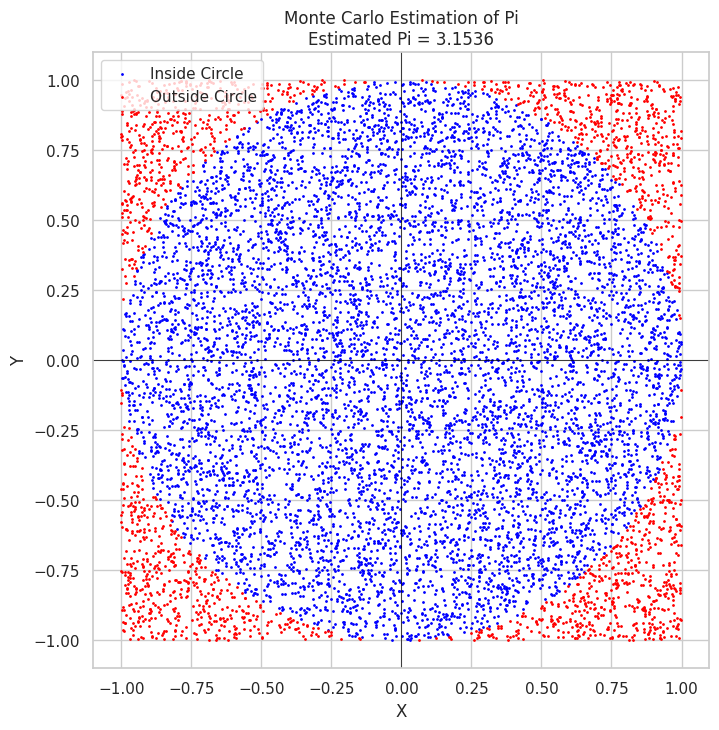
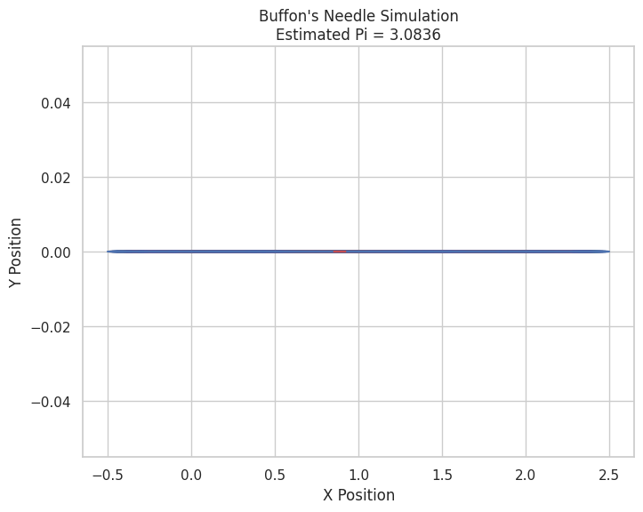

# Problem 2

## **Part 1: Estimating Pi Using a Circle-based Monte Carlo Method**

### **1. Theoretical Foundation**

The basic idea behind using the Monte Carlo method to estimate Pi involves generating random points within a square that bounds a unit circle and calculating the ratio of points inside the circle to the total number of points.

- **Unit Circle**: A circle with a radius of 1, centered at the origin (0,0), where the equation of the circle is \(x^2 + y^2 \leq 1\).
- **Square**: The square bounds the unit circle. For simplicity, we assume the square has side length 2, so it spans from \((-1, -1)\) to \((1, 1)\).

The idea is:
- The area of the square is \( 2 \times 2 = 4 \).
- The area of the circle is \( \pi \times r^2 = \pi \) (since the radius \( r = 1 \)).

The ratio of the points that fall inside the circle to the total points is approximately the ratio of the areas of the circle to the square, which is:

\[
\frac{\text{points inside the circle}}{\text{total points}} \approx \frac{\pi}{4}
\]

From this, we can estimate Pi as:

\[
\pi \approx 4 \times \frac{\text{points inside the circle}}{\text{total points}}
\]

### **2. Simulation**

To simulate this, we will:
1. Generate random points in the 2D square.
2. Count how many points fall inside the unit circle.
3. Estimate Pi based on the ratio of points inside the circle to total points.

### **3. Visualization**

We will create a plot showing the random points inside and outside the circle, with points inside the circle shown in one color and those outside in another.

### **Python Code for Circle-based Monte Carlo Method**

### **Explanation of the Code:**
- We generate random points using `np.random.uniform(-1, 1, num_points)`, which gives us random `x` and `y` values between -1 and 1.
- The condition `x**2 + y**2 <= 1` checks if the point lies inside the unit circle.
- The estimate of Pi is calculated by the formula \( \pi \approx 4 \times \frac{\text{points inside the circle}}{\text{total points}} \).
- Finally, we plot the points, color-coding the points inside and outside the circle.

---

## **Part 2: Estimating Pi Using Buffon’s Needle**

### **1. Theoretical Foundation**

Buffon's Needle is a probability problem that involves dropping a needle of length \( L \) onto a floor with parallel lines spaced a distance \( D \) apart. The problem estimates Pi by calculating the probability that the needle will cross one of the lines. The formula for the probability \( P \) that the needle crosses a line is:

\[
P = \frac{2L}{\pi D}
\]

From this, we can solve for Pi:

\[
\pi \approx \frac{2L}{P D}
\]

In this problem:
- \( L \) is the length of the needle.
- \( D \) is the distance between parallel lines.
- \( P \) is the probability of the needle crossing a line, which can be estimated by simulating needle drops and counting how many times the needle crosses a line.

### **2. Simulation**

To simulate Buffon’s Needle:
1. Randomly drop a needle of length \( L \) onto the floor.
2. Count how many times the needle crosses a line.
3. Estimate Pi based on the derived formula.

### **3. Visualization**

We will create a plot showing the needle drops and whether the needle crosses a line or not.

### **Python Code for Buffon’s Needle Simulation**

### **Explanation of the Code:**
- We simulate the random drop of a needle by choosing a random position for the needle relative to the lines and a random angle.
- If the needle crosses a line (i.e., if the distance from the center of the needle to the line is smaller than the length of the needle at that angle), it’s counted as a crossing.
- The estimate of Pi is then computed using the formula based on the number of crossings and the number of drops.

---

## **Analysis and Convergence**

To analyze how the accuracy improves with more simulations, you can plot the estimated Pi values after each iteration. This allows you to see the convergence rate for both methods. In general, the more points or needle drops you use, the closer the estimate of Pi will get to the true value.

You can also compare the two methods in terms of accuracy and computational efficiency. The Monte Carlo method using the circle is generally faster for large numbers of iterations, while Buffon’s Needle requires more complex geometric calculations.

---

### **Conclusion**

This task demonstrates two different Monte Carlo methods to estimate Pi, one using a circle-based approach and the other based on Buffon’s Needle. Both methods illustrate the power of random sampling in numerical simulations, and they converge towards the true value of Pi as the number of iterations increases.
