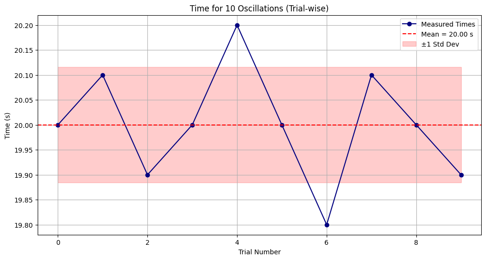
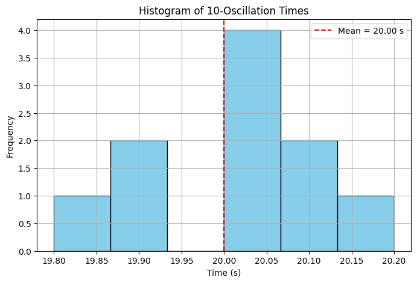
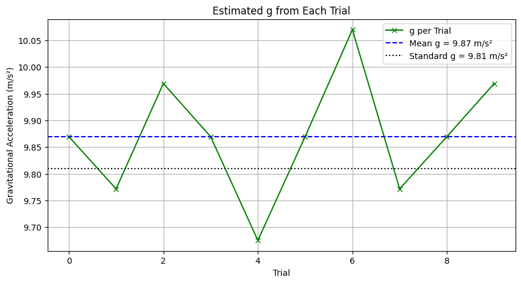

# Problem 1

## 📘 Measuring Earth's Gravitational Acceleration with a Pendulum

### 🔬 Objective
The aim is to estimate Earth's gravitational acceleration \( g \) using a simple pendulum and analyze how uncertainties in measurement affect the final result. This classic physics experiment demonstrates the relationship between pendulum period and gravitational pull using the formula:

\[
g = \frac{4\pi^2 L}{T^2}
\]

Where:
- \( L \) is the length of the pendulum
- \( T \) is the time period of one complete oscillation

---

### 🧪 Materials & Setup
- **String Length**: ~1.00 m  
- **Pendulum Mass**: Any small weight (e.g., keys, washers)  
- **Timer**: Stopwatch or phone timer  
- **Length Measurement Tool**: Ruler or tape (±0.5 cm typical resolution)  
- The pendulum is released at a small angle (<15°) and swings freely.

---

### 📏 Measurements

We perform 10 independent trials, each recording the time for 10 oscillations. This reduces the error caused by human timing.

```python
# Measurement Data: 10 trials of 10 oscillations each
T_10_trials = np.array([20.0, 20.1, 19.9, 20.0, 20.2, 20.0, 19.8, 20.1, 20.0, 19.9])
```

From this data:
- Compute mean \( \bar{T}_{10} \)
- Find period \( T = \bar{T}_{10} / 10 \)
- Compute standard deviation to estimate uncertainty

---

### 📈 Plot 1: Time for 10 Oscillations (Trial-wise)
This line plot helps you identify how consistent your timing was across trials. It also visualizes the spread of data and standard deviation range.



---

### 📊 Plot 2: Histogram of Time Measurements

The histogram gives a sense of frequency distribution in the measurements — a useful way to visually confirm normality or bias in timing.



---

### 📉 Plot 3: Estimated \( g \) per Trial

If we hypothetically used each trial on its own (without averaging), we’d get different values of \( g \). This plot shows the variation, reinforcing why averaging is important.



---

### 📐 Calculations Summary

1. **Average period \( T \):**

\[
T = \frac{\bar{T}_{10}}{10}
\]

2. **Standard deviation of the mean:**

\[
\Delta T = \frac{\sigma}{10 \sqrt{n}}
\]

3. **Gravitational acceleration:**

\[
g = \frac{4\pi^2 L}{T^2}
\]

4. **Uncertainty in \( g \):**

\[
\Delta g = g \cdot \sqrt{ \left( \frac{\Delta L}{L} \right)^2 + \left(2 \cdot \frac{\Delta T}{T} \right)^2 }
\]

---

### 🧠 Analysis

- **Measurement Resolution**:
  - The smallest increment on your measuring tape determines \( \Delta L \).
  - A 0.5 cm resolution → uncertainty \( \Delta L = \pm 0.005 \, \text{m} \)

- **Timing Error**:
  - Human reaction time is ~0.2 s
  - Measuring 10 swings minimizes this by averaging out fluctuations

- **Comparison with Standard**:
  - If your result is within ±Δg of **9.81 m/s²**, the experiment is successful.

---
